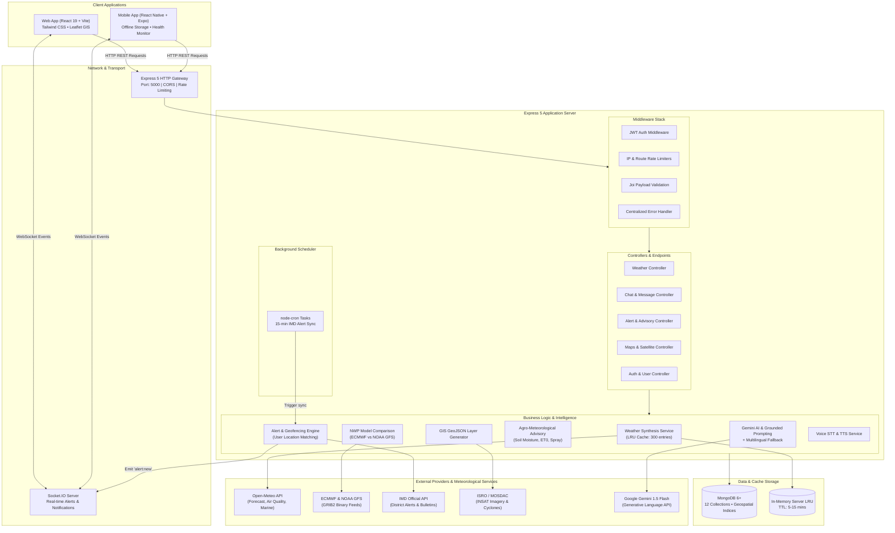

# 02. System Architecture & Data Flow

## 🏛️ End-to-End System Topology



---

## 🔄 Core Data Flow Pipelines

### 1. The Conversational Weather Flow (`POST /api/messages`)

```
User Query: "What is the weather in Pune today and can I spray pesticide?"
                               │
                               ▼
            1. Regex & NLP Location Extraction
               - Candidate extracted: "Pune"
               - Language detected: "en" (English)
                               │
                               ▼
            2. Geocoding Resolution (Open-Meteo)
               - Pune -> Lat: 18.5204, Lng: 73.8567
                               │
                               ▼
        ┌──────────────────────┴──────────────────────┐
        ▼                                             ▼
3a. Parallel Meteorological Fetch             3b. Parallel Context Fetch
   - Live Weather (Open-Meteo)                   - Active IMD District Warnings
   - NWP Comparison (GFS vs ECMWF)               - Agro Advisory (Soil, Wind, Rain)
   - Air Quality (AQI, PM2.5, PM10)
        └──────────────────────┬──────────────────────┘
                               │
                               ▼
            4. Grounded Context Construction
               - Verified metrics assembled into JSON facts
               - Strict hallucination barrier (System Prompt)
                               │
                               ▼
            5. AI Response Generation
               ├── IF Gemini API Key present ──> Google Gemini 1.5 Flash
               └── IF Gemini API Key absent  ──> Deterministic Multilingual Engine
                               │
                               ▼
            6. Persistence & Response Delivery
               - Save User & Assistant Message in MongoDB
               - Return conversational text + rich weather widgets
```

---

### 2. The Real-Time Alert & Geofencing Pipeline

```
            Background Cron Job (Runs every 15 minutes)
                               │
                               ▼
            1. Fetch Official IMD Warning Bulletins
                               │
                               ▼
            2. Upsert Alerts to MongoDB (`alerts` collection)
               - Deduplicate against `externalId`
               - Assign severity: Extreme (Red), High (Orange), Moderate (Yellow)
                               │
                               ▼
            3. Geofencing & User Matching (`notifyMatchedUsers`)
               - Query `saved_locations` where city or coordinates match
               - Identify distinct `userId`s affected by the hazard
                               │
                               ▼
        ┌──────────────────────┴──────────────────────┐
        ▼                                             ▼
4a. Persistent Notification                   4b. Real-Time Push
   - Insert records into                         - Emit WebSocket event
     `notifications` collection                    `notification:alert`
     (status: unread)                              via Socket.IO
```

---

## ⚡ Multi-Tier Caching Architecture

Weather intelligence requests are read-heavy and computationally intensive. The architecture uses a three-tier caching strategy:

```
[ Frontend Client Cache ] ──> [ Server LRU Cache ] ──> [ External API / Disk ]
  TTL: 30s - 2m                 TTL: 5m - 15m            HTTP Cache / NWP Files
  Max: 120 entries              Max: 300 entries
  In-flight deduplication       In-flight lock
```

### Layer 1: Client In-Memory Cache (`frontend/src/services/api.js`)
- **Capacity:** Bounded LRU-style map up to 120 entries.
- **TTL Strategy:**
  - `30 seconds` for real-time mutating routes (`/alerts`, `/warnings`, `/notifications`).
  - `2 minutes` for static or standard weather (`/weather`, `/forecast`, `/maps`, `/climate`).
- **In-Flight Request Deduplication:** If multiple React components request the same weather query concurrently, only **one** HTTP request is dispatched; subsequent callers await the identical in-flight promise.
- **Cache Invalidation:** Any mutation (`POST`, `PUT`, `DELETE`, `PATCH`) immediately wipes the client cache to prevent stale state.

### Layer 2: Backend In-Memory LRU Cache (`backend/src/services/weather/weatherService.js`)
- **Capacity:** Bounded map up to 300 entries.
- **TTL Constants:** Defined in `backend/src/config/constants.js`:
  - `WEATHER_CURRENT`: 10 minutes.
  - `WEATHER_FORECAST`: 30 minutes.
  - `IMD_WARNINGS`: 15 minutes.
- **In-Flight Locking:** Prevents cache stampedes when external NWP models or Open-Meteo are slow.

### Layer 3: Cache Metadata Transparency
All synthesized weather responses attach explicit cache diagnostic headers:
```json
{
  "cache": {
    "isCached": true,
    "isStale": false,
    "cachedAt": "2026-09-08T13:45:00.000Z",
    "ageMs": 42150
  }
}
```

---

## 🛡️ Resilience & Failover Strategy

Weather systems must remain operational during severe emergencies when external APIs or internet backbones might be disrupted:

| Subsystem | Primary Provider | Tier-1 Fallback | Tier-2 Fallback (Offline) |
| :--- | :--- | :--- | :--- |
| **Current Weather** | Open-Meteo High-Res | NOAA GFS 0.25° | Offline Local Weather Simulator (`offlineWeather.js`) |
| **NWP Model Comparison** | Real ECMWF & GFS GRIB2 | Open-Meteo Multi-Model | Interpolated parametric spread engine |
| **Official Alerts** | Live IMD Warning Feed | Seeded IMD Archive | Cached database alerts with stale flag |
| **Conversational AI** | Google Gemini 1.5 Flash | Deterministic Multilingual Grounded Generator | Rule-based localized templates |
| **GIS Mapping** | Live GeoJSON endpoints | MongoDB stored stations | Local seed GeoJSON datasets (`stations.seed.js`) |
| **Database Connection** | Local/Remote MongoDB | In-memory session mock | Graceful error status with HTTP 503 |
