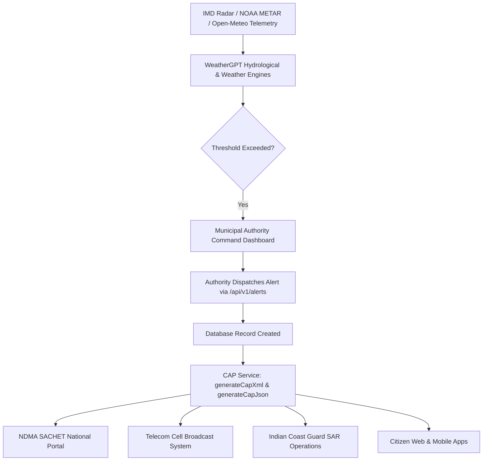

# 🚨 ITU-T X.1303 / OASIS CAP v1.2 Standard Alert Interoperability Engine

> **Standard Compliance:** ITU-T Recommendation X.1303, OASIS Common Alerting Protocol (CAP) v1.2, NDMA SACHET National Early Warning Integration Standard  
> **Backend Service:** `backend/src/services/cap/capService.js`  
> **Backend Controller & Routes:** `backend/src/controllers/alertController.js`, `backend/src/routes/alertRoutes.js` (`/api/v1/alerts/:id/cap.xml`, `/api/v1/alerts/:id/cap.json`)  
> **Frontend Integration:** `frontend/src/pages/authority/AuthorityAlertsPage.jsx`  
> **Target Systems:** NDMA SACHET, IMD Warning Dissemination, State Disaster Management Authorities (SDMAs), Indian Coast Guard

---

## 1. Executive Overview & Problem Context
In major disasters (cyclones, cloudbursts, tsunamis), critical warning time is lost when emergency response agencies use proprietary, closed alert formats. Fire departments, police, Coast Guard, telecom operators (Cell Broadcast SMS), and international bodies cannot automatically ingest warnings unless they adhere to the **OASIS Common Alerting Protocol (CAP v1.2)**.

The **WeatherGPT CAP Interoperability Engine** bridges this gap by automatically converting all system-generated or authority-dispatched weather warnings into **standard ITU-T X.1303 / CAP v1.2 XML and JSON documents**, enabling zero-delay dissemination to national alert gateways (NDMA SACHET).

---

## 2. CAP v1.2 Document Architecture & Schema Mapping

Each alert dispatched by WeatherGPT produces an OASIS CAP v1.2 compliant payload structured into two core tiers:

### A. Document Header Element (`<alert>`)
Contains global routing and message authenticity metadata:

```xml
<alert xmlns="urn:oasis:names:tc:emergency:cap:1.2">
  <identifier>WEATHERGPT-ALERT-1726014200000-8472</identifier>
  <sender>authority@weathergpt.gov.in</sender>
  <sent>2026-09-11T00:30:00+05:30</sent>
  <status>Actual</status>
  <msgType>Alert</msgType>
  <source>WeatherGPT Multi-Model NWP & Municipal Sensor Network</source>
  <scope>Public</scope>
  <code>IPAWS-CAP-1.2</code>
  <code>NDMA-SACHET-V1.2</code>
  <note>Automated standard export from WeatherGPT Early Warning Platform</note>
  ...
</alert>
```

- **`identifier`**: Globally unique, collision-resistant identifier prefixed with system namespace.
- **`sender`**: Verified disaster authority or municipal command center user.
- **`sent`**: ISO 8601 timestamp with Indian Standard Time offset (`+05:30`).
- **`status`**: `Actual` for production emergencies; supports `Test`, `Draft`, `Exercise`.
- **`msgType`**: `Alert` (initial warning), `Update` (track changes), `Cancel` (cancellation).
- **`scope`**: `Public` for broadcast across sirens, cell broadcast, and citizen apps.

### B. Informational Container Element (`<info>`)
Encapsulates hazard categorization, severity thresholds, affected geography, and protective instructions:

| CAP v1.2 Element | Mapped Value | Description |
| :--- | :--- | :--- |
| **`<category>`** | `Met` | Meteorological / Hydrological hazard category. |
| **`<event>`** | *e.g. Cyclone / Flash Flood* | Standard hazard title. |
| **`<urgency>`** | `Immediate` / `Expected` | Responsive window for civilian action. |
| **`<severity>`** | `Extreme` / `Severe` / `Moderate` | Impact severity rating. |
| **`<certainty>`** | `Observed` / `Likely` | Probability based on ECMWF/GFS ensemble consensus. |
| **`<eventCode>`** | `SAME:FLW` / `IMD:CYC` | Specific Area Message Encoding (SAME) and IMD hazard code. |
| **`<expires>`** | ISO 8601 Timestamp | Expiration timestamp for automatic alert retraction. |
| **`<headline>`** | String (Max 140 chars) | Summary suitable for SMS / Emergency Siren displays. |
| **`<description>`**| Text block | Full meteorological narrative and impact assessment. |
| **`<instruction>`**| Text block | Immediate protective actions (evacuation routes, helpline numbers). |
| **`<area>`** | Sub-tree | `<areaDesc>` (District/State) + Geographic `<polygon>` coordinates. |

---

## 3. End-to-End Interoperability Workflow



---

## 4. REST API Reference

### `GET /api/v1/alerts/:id/cap.xml`
Exports the specified alert as a valid ITU-T X.1303 / OASIS CAP v1.2 XML document.

- **URL Parameter:** `id` (MongoDB Alert ObjectId, e.g. `66e017839...`)
- **Headers:** `Content-Type: application/xml; charset=utf-8`
- **Sample Request:**
  ```bash
  curl -X GET http://localhost:5000/api/v1/alerts/66e017839.../cap.xml
  ```
- **Sample Response:**
  ```xml
  <?xml version="1.0" encoding="UTF-8"?>
  <alert xmlns="urn:oasis:names:tc:emergency:cap:1.2">
    <identifier>WEATHERGPT-ALERT-66e017839-1726014200</identifier>
    <sender>authority@weathergpt.gov.in</sender>
    <sent>2026-09-11T00:30:00+05:30</sent>
    <status>Actual</status>
    <msgType>Alert</msgType>
    <scope>Public</scope>
    <code>NDMA-SACHET-V1.2</code>
    <info>
      <category>Met</category>
      <event>Flash Flood Warning</event>
      <urgency>Immediate</urgency>
      <severity>Severe</severity>
      <certainty>Likely</certainty>
      <headline>Severe Urban Waterlogging Alert for Mumbai Low-Lying Hotspots</headline>
      <description>Drainage saturation exceeded 1.6x capacity due to 65 mm/hr rainfall.</description>
      <instruction>Avoid Andheri Subway and Hindmata. Seek higher ground.</instruction>
      <area>
        <areaDesc>Mumbai, Maharashtra</areaDesc>
        <circle>19.0886,72.8679,15.0</circle>
      </area>
    </info>
  </alert>
  ```

### `GET /api/v1/alerts/:id/cap.json`
Exports the alert in standard CAP JSON representation.

- **Sample Request:**
  ```bash
  curl -X GET http://localhost:5000/api/v1/alerts/66e017839.../cap.json
  ```
- **Sample Response:**
  ```json
  {
    "identifier": "WEATHERGPT-ALERT-66e017839-1726014200",
    "sender": "authority@weathergpt.gov.in",
    "sent": "2026-09-11T00:30:00+05:30",
    "status": "Actual",
    "msgType": "Alert",
    "scope": "Public",
    "info": {
      "category": "Met",
      "event": "Flash Flood Warning",
      "urgency": "Immediate",
      "severity": "Severe",
      "certainty": "Likely",
      "headline": "Severe Urban Waterlogging Alert...",
      "area": { "areaDesc": "Mumbai, Maharashtra" }
    }
  }
  ```

---

## 5. Authority Frontend UI Features (`AuthorityAlertsPage.jsx`)
In the Authority Command Center, each active or archived emergency warning card features:
1. **"CAP 1.2 XML" Download Button**: Generates and downloads the official XML file for upload to NDMA SACHET.
2. **"CAP 1.2 JSON" Download Button**: Supplies real-time JSON for automated REST consumers.
3. **Live XML Preview Modal**: Permits emergency operators to inspect and verify the raw ITU XML before distribution.

---

## 6. Verification & Test Coverage
- Unit test suite: `test/unit/sihAdvancedFeatures.test.js`
- Test cases:
  1. Valid ITU / OASIS CAP v1.2 XML schema generation with correct XML tags and namespaces.
  2. Standard CAP JSON format structure and field fidelity.
- Production build: Verified in `AuthorityAlertsPage.jsx` and built with `npm run build --prefix frontend`.
